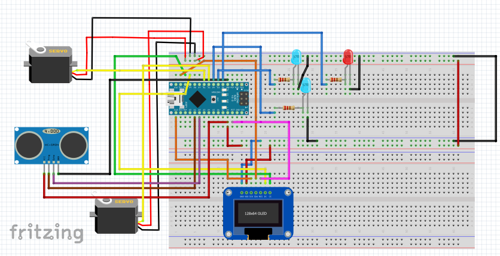

# monitor-sec-system
small monitoring security system build with Arduino

# Schematics

made in Fritzing

# Features 
- can detect objects within 4m (depends on ultrasonic sensor) and 180 degrees (depends on servo range)
- has 3 modes of work depending on the distance of the object
- integrated lights and 2nd servo for expressing how close the incoming object is
- displays messages according to a position of the detected object

# Future work
- increase range
- integrate with sound effects
- integrate with weapon e.g. small turret (not nessesarily lethal) for better security

# Requirements

## Components
- Arduino Nano
- Ultrasonic Sensor HC-SR04
- 3 LED lights
- 1 Graphic OLED, 128x64
- 3 resistor 220 R
- 2 servo 180 grados
- 26 connectors (male-to-male)
- 1 breadboard

## Apps and platforms
- Arduino IDE 2.0 (or older 1.x should also work)

## Libraries to install (on Arduino IDE)
- servo (controlling servos)
- U8glib (controlling OLED display)

# Usage
Upload the code to the Arduino microcontroller and run the program.

Below features of system's work mode are described:

| Message | distance [cm] | System reaction |
| ----------- | ------------ | --------- |
| Danger at | 0 - 99 | 2nd servo spinning very quickly, blinking red light |
| Object incoming at | 100 - 199 | 2nd servo spinning quickly, blue leds are on |
| Object detected at | 200 - 399 | 2nd servo spinning, blue leds on |

